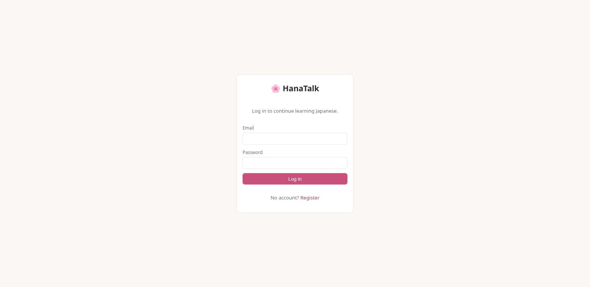
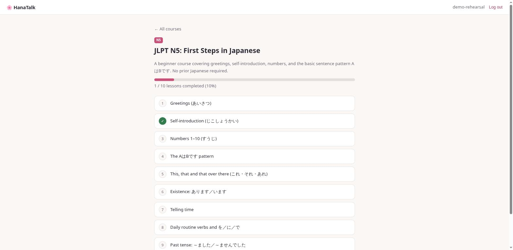

# 🌸 HanaTalk

[](https://github.com/AndresGalvan05/hana-talk/actions/workflows/core-api.yml)
[](https://github.com/AndresGalvan05/hana-talk/actions/workflows/frontend.yml)
[](https://github.com/AndresGalvan05/hana-talk/actions/workflows/ai-exercise-svc.yml)
[](https://github.com/AndresGalvan05/hana-talk/actions/workflows/event-worker.yml)

Japanese language-learning platform organized around **JLPT levels (N5–N1)**.
Portfolio project demonstrating polyglot backend engineering across
Kotlin/Spring Boot, Python/FastAPI, and Go, tied together with Kafka and
deployed on Kubernetes.

**🔴 Live at [https://hanatalk.online](https://hanatalk.online)** — Cloudflare-proxied, single-node k3s on Oracle Cloud (A1 Flex, aarch64)

See [`docs/ARCHITECTURE.md`](docs/ARCHITECTURE.md) for the full trade-offs
discussion (sync/async boundary, the outbox trade-off, ownership
boundaries, security, observability) and [`docs/DEMO_SCRIPT.md`](docs/DEMO_SCRIPT.md)
for a runnable 2-minute walkthrough.

<p align="center">
  
  
</p>

---

## Architecture

```
                    +-------------+
                    |   React     |
                    |  Frontend   |
                    +------+------+
                           | HTTPS (via Cloudflare)
                           v
              +------------------------+
              |   Core API (Gateway)   |
              |  Kotlin + Spring Boot  |
              |  - Auth (JWT)          |
              |  - Users & progress    |
              |  - Courses/lessons     |
              |  - PostgreSQL          |
              +-----+----------+-------+
         sync REST    |          |  Kafka events
   (exercise request) |          |  (user.registered,
                       v          |   exercise.completed)
          +--------------------+ |
          |  AI Exercise Svc   | |
          |  Python + FastAPI  | |            v
          |  - LLM failover    | |   +------------------+
          |  - MongoDB         | +-->|  Event Worker    |
          +--------------------+     |  Go              |
                                     |  - Streaks       |
                                     |  - Leaderboard   |
                                     +------------------+
```

## Service status

| Service | Stack | Status |
|---|---|---|
| [core-api](core-api/) | Kotlin + Spring Boot + PostgreSQL | **Working.** JWT auth, courses/lessons, JLPT progress tracking, Kafka publishing, Prometheus metrics + OTel tracing, Flyway V1–V12 (5-chapter N5 course seeded, structured content, Genki-referenced), 4 exercise types (MCQ/fill-in-blank/translation/sentence-ordering), controller tests, CI |
| [frontend](frontend/) | React + TypeScript (Vite) | **Working.** Auth, course browsing, lessons, progress, LLM-generated practice exercises; nginx production image |
| [ai-exercise-svc](ai-exercise-svc/) | Python + FastAPI + MongoDB | **Working.** Gemini → Groq → OpenRouter provider failover chain, Mongo cache per lesson; called synchronously by core-api |
| [event-worker](event-worker/) | Go + Kafka consumer | **Working.** Consumes `user.registered`/`exercise.completed`, day-granularity streaks + leaderboard, proxied through core-api |
| [infra](infra/k8s/) (k8s on Oracle) | k3s, Kafka (KRaft), Cloudflare | **Deployed.** Single-node k3s running all five services (core-api, frontend, ai-exercise-svc, event-worker, MongoDB), multi-arch GHCR images, Traefik + Origin CA TLS — see the [runbook](infra/k8s/README.md) |

**Key design decisions:**

- The Core API is the single gateway — the frontend never calls other services directly.
- Exercise generation is **synchronous** (user is waiting). Side effects (streaks,
  leaderboard) are **asynchronous** via Kafka. Realistic split, not "Kafka for everything."
- `ai-exercise-svc` tries Gemini → Groq → OpenRouter, falling through on any failure
  (transport or schema-validation) — free-tier LLM APIs make failover a real
  requirement, not a demo.
- Postgres and MongoDB each have a specific reason: relational structure for
  users/auth/progress, variable-shape document storage for generated exercise content.
- Kafka publishing is fire-and-forget with error logging (`EventPublisher.kt`); a
  transactional outbox is deliberately deferred — see
  [`docs/ARCHITECTURE.md`](docs/ARCHITECTURE.md) for the full trade-offs discussion.

---

## What's next 🚧

M1–M5 shipped the full polyglot stack end to end; current work is deepening
what it actually teaches and how you interact with it, one slice at a time.

**Shipped so far:**
- **Structured lesson content** — real chapters (vocabulary lists, multiple
  grammar points with examples, a dialogue, a culture note per lesson)
  instead of flat-text paragraphs.
- **New exercise types** — translation and sentence-ordering (click-to-order
  UI), alongside the existing multiple-choice and fill-in-the-blank.

**Still ahead:**
- **AI conversation practice** — a chat page to converse with an LLM tutor
  in Japanese and get corrections, reusing `ai-exercise-svc`'s existing
  Gemini → Groq → OpenRouter failover chain for a new, free-form purpose.
- **Vocabulary flashcards with spaced repetition** — a daily review queue
  across everything you've learned so far.
- **Audio pronunciation** — text-to-speech for vocabulary and example
  sentences.

Tracked as OpenSpec changes under `openspec/changes/` as each one is
proposed and built — see `docs/ROADMAP.md`'s decision log for the running
history of what's shipped versus what's still ahead.

---

## Core API surface (current)

| Endpoint | Auth | Purpose |
|---|---|---|
| `POST /api/auth/register`, `POST /api/auth/login` | public | JWT issue |
| `GET /api/courses`, `GET /api/courses/{id}` | public | Browse courses, filter by `?jlptLevel=` |
| `GET /api/courses/{id}/lessons`, `.../lessons/{id}` | public | Lesson content |
| `POST/PUT/DELETE` on courses & lessons | JWT, `ADMIN` role | Content CRUD |
| `POST /api/courses/{c}/lessons/{l}/complete` | JWT | Mark lesson complete (publishes `exercise.completed`) |
| `GET /api/courses/{id}/progress` | JWT | Per-course completion |
| `GET /api/users/me`, `PATCH /api/users/me/level` | JWT | Profile & JLPT level |
| `GET /api/lessons/{id}/exercises` | JWT | LLM-generated (or seeded) exercises, no answers |
| `POST /api/exercises/{id}/attempts` | JWT | Grade an attempt (publishes `exercise.completed`) |
| `GET /api/users/me/streak`, `GET /api/leaderboard` | JWT | Day-granularity streak & leaderboard (proxied to `event-worker`) |

---

## Local setup

### Prerequisites

- Docker and Docker Compose
- JDK 21 (only for running Gradle outside Docker)

### Run with Docker Compose

```bash
cd infra
docker compose up --build
```

Starts Postgres, Kafka (KRaft single node), and the Core API at
`http://localhost:8080`. The database is seeded with an N5 starter course via
Flyway, so the API is demoable immediately.

**Health checks:**

```bash
curl http://localhost:8080/api/health        # {"status":"ok"}
curl http://localhost:8080/actuator/health   # {"status":"UP", ...}
```

### Run tests

```bash
cd core-api
./gradlew test
```

Tests use `@WebMvcTest` and run without a database — safe to run locally without
Postgres or Docker.

---

## Roadmap (milestones, not calendar weeks)

| Milestone | Goal |
|---|---|
| **M1 — Vertical slice** ✅ | React frontend: register → log in → browse seeded N5 course → complete lessons → see progress. CORS, JWT in the browser. |
| **M2 — Deployed & public** ✅ | k3s on Oracle Always Free, images pushed to GHCR from CI, Kafka in-cluster, Cloudflare TLS at hanatalk.online. |
| **M3 — AI exercises** ✅ | Exercise domain in core-api (MCQ / fill-in-blank, graded in the gateway) + Python FastAPI generation service with LLM provider failover and MongoDB caching. |
| **M4 — Async side effects** ✅ | Go event-worker: Kafka consumer group, streaks + leaderboard, read API proxied through the gateway. |
| **M5 — Polish** ✅ | Cross-service OTel tracing, Grafana Cloud dashboards, admin role for content CRUD, architecture/decisions doc. |

The original 5-milestone roadmap is complete. Current work (see **What's
next** above) is a second phase deepening the actual learning content and
interactivity, tracked milestone-free as individual OpenSpec changes rather
than a fixed set of numbered milestones.

---

## CI/CD

Each service has its own GitHub Actions workflow triggered only when its
directory changes, all pushing a multi-arch (amd64+arm64) image to GHCR on
`main`:

- `.github/workflows/core-api.yml` — lint (ktlint), test, build jar.
- `.github/workflows/frontend.yml` — lint (oxlint), build.
- `.github/workflows/ai-exercise-svc.yml` — lint (ruff), test (pytest).
- `.github/workflows/event-worker.yml` — `go vet`, `go test`.

Deploys are a `kubectl rollout restart` away — see the
[k8s runbook](infra/k8s/README.md) for the full deploy/rollback procedure.
